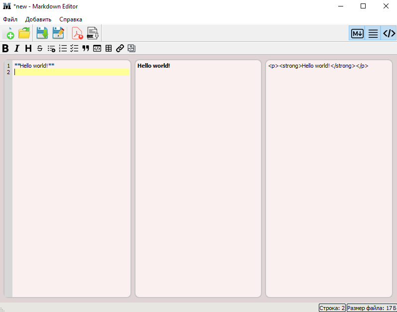
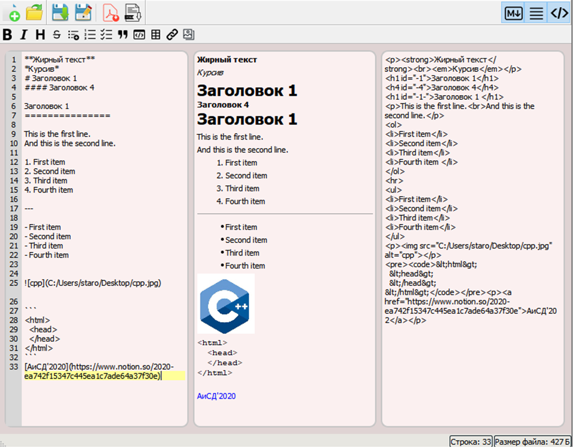
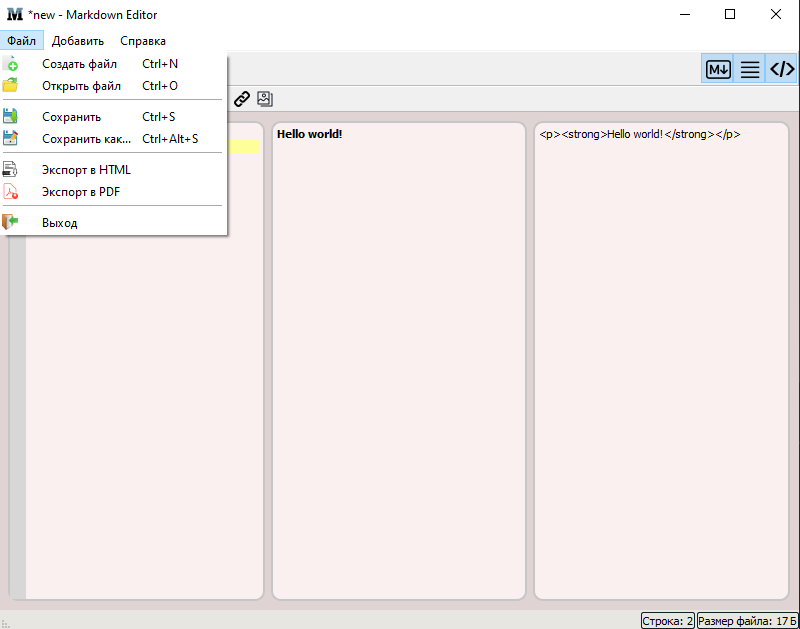
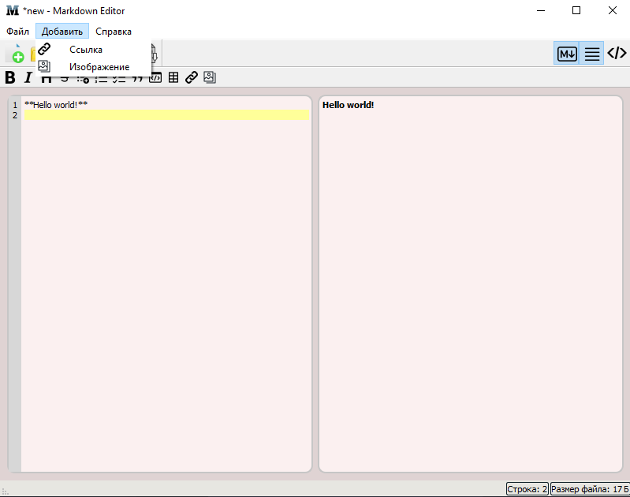
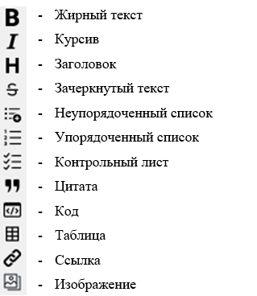

# Markdown Editor

The course work is written in the C++ programming language using the Qt framework. 
All tasks have been completed, and a fully working and functional Markdown file editor has been developed with the possibility of live preview of the result, 
which is possible based on the entered markup. The program interface contains three workspaces that can be turned on and off at the user's request. 
The program supports all constructions of the Markdown text markup language, also translated into HTML markup language and PDF.

Menu Functions:
- File
  - Create a new file
  - Upload a file
  - Save
  - Save as...
  - Export to HTML
  - Export to PDF
- Add
  - Link
  - Image
- View
  - Editor + preview
  - Markdown editor only
  - HTML Preview

---

## Markdown Editor interface

## Markdown examples 

## Menu Bar File

## Menu Bar Add

## Toolbar

